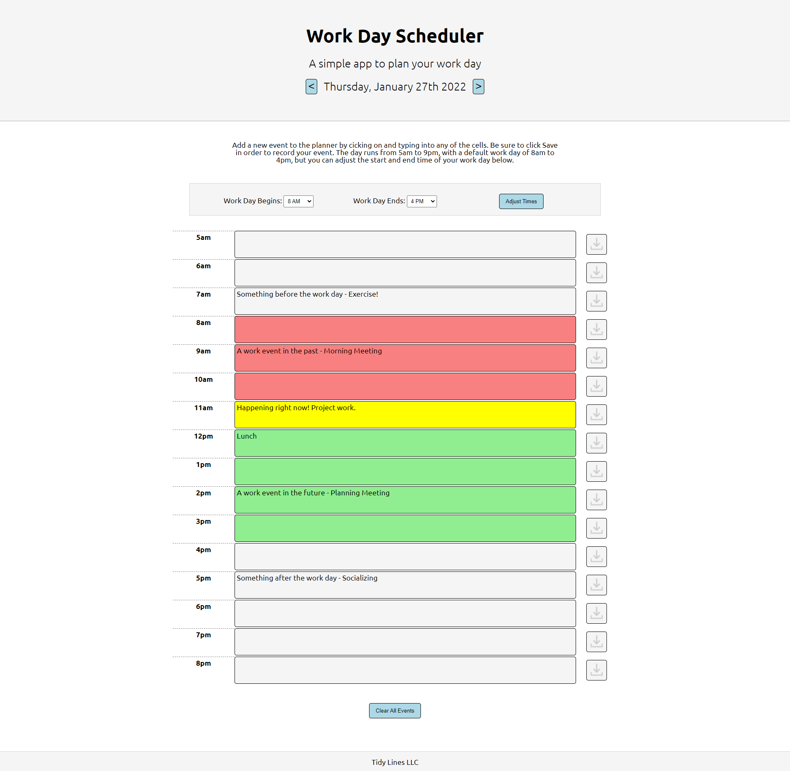

# day-organizer
Simple application to organize events within a single day

## Application Details
This application uses jQuery, JavaScript and localStorage to present a planner to enter and save hourly events. Events are saved within the browser's local storage and the date can be changed with the event list displaying events accordingly. 

The work day can be defined and must be at least 4 hours long anbd the cells are color coded relative to the current date and time. Hours outside the user defined work day may have events added and saved, but are not color coded. The current hour is diplayed yellow on the current day. Within the work hour parameters, hours in the past are one color, and hours in the future render as another.

By default the planner shows today's date, with a work day defined from 8AM to 4PM.

## Links
The deployed website can be found [here](https://benfok.github.io/day-organizer/)

The repository in GitHub is [here](https://github.com/benfok/day-organizer)

## Screenshot
Here is a screenshot of my finished page. Some key details and learnings are below.

## Details and Learnings
- jQuery allowed for more efficient code for working with event handlers across multiple elements with shared classes
- moment.js was used to get and render the current date and adjust the date
- Each time the date is change the event cell classes and text needed to be cleared, new cell ids assigned specific to the date and styles reapplied based on the time in order to render the page correctly and handle loading events for the newly selected date
- Allowing the user to define their own "work day" with a minimum 4 hours span was an interesting way to add context to the planner as only "working hours" are color styled. Some nested conditional statements were required to handle the various time and hour combinations relative to the styling
- In order to retain events saved across multiple dates and times I needed to use a short form of the date and time to create a unique keyname for local storage. This could possibly have been saved within an array of objects rather than as unique key names per event. JSON.stringify and JSON.parse would have been helpful in this case
- It was a fun challenge to try to incorporate all this functionality without reloading the page

## Future Enhancements
Ideas for how to enhance the application:
- Automatically save after clicking/tabbing out of an event cell. A save button per row is not necessary.
- Handle weekends or non-work days
- Color coding defined by the user
- Text formatting on the event entries is not saved
- Allow breakdown into 30 minute slots and for events spanning multiple 'cells' 
